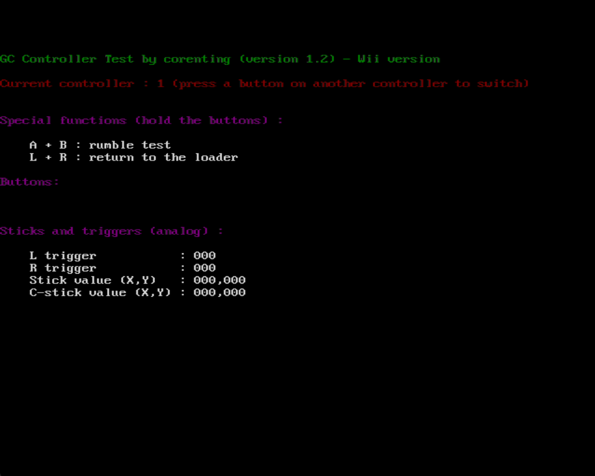

# GC-Controller-Test

A simple homebrew to test your Gamecube controllers.

Works on both Wii and Gamecube.

## Downloads

[See the releases section on Github](https://github.com/corenting/GC-Controller-Test/releases).

## How to compile

- With devkitpro installed:
    - For GameCube: `TARGET_CONSOLE=gamecube make`
    - For Wii: `TARGET_CONSOLE=wii make`
- Without devkitpro installed, use the `build_docker.sh` which uses the devkitpro/devkitppc Docker image to build:
    - For GameCube: `./build_docker.sh gamecube`
    - For GameCube: `./build_docker.sh wii`
